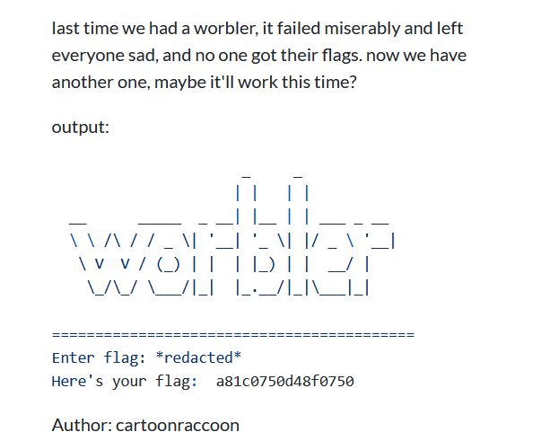

+++
date = '2024-01-15'
title = '[UofT CTF 2024] All Worbled Up Write-up'
tags = ["Reverse Engineering", "CTF", "Write-up"]
+++

# All Worbled Up
## Challenge description


From the output, we can tell that the input is the flag we need to find, the program takes it in and gives us back some sort of strings, and we need to reverse the process somehow.

This challenge only gives us a text file containing Python assembly. At first I tried to convert what the challenge gives back to python code but no luck (or I didn't look hard enough). However, since each function is short enough, I tried to decompile the original code.
## Decompiling the assembly
After finding information here and there on the internet, I learned about [Disassembler for Python bytecode](https://docs.python.org/3.11/library/dis.html), where it documented most of the codes appear in this challenge.

Python uses its stack for most of the instruction we see, the pattern is:
1. Push the function name into the stack.
2. Push the parameters for into the stack.
3. Call the function with its parameters at the top of the stack, pop the function name and its parameters out of the stack.
4. Push the return value into the stack.

Let's jump straight into where the output is printed
```
 42         478 LOAD_GLOBAL              5 (NULL + print)
            490 LOAD_CONST              17 ("Here's your flag:")
            492 PUSH_NULL
            494 LOAD_FAST                3 (shmorble)
            496 PUSH_NULL
            498 LOAD_FAST                4 (blorble)
            500 LOAD_FAST                6 (a)
            502 LOAD_FAST                7 (b)
            504 PRECALL                  2
            508 CALL                     2
            518 PRECALL                  1
            522 CALL                     1
            532 PRECALL                  2
            536 CALL                     2
```
I will visualize how the stack looks like during the run time and hopefully after that we can reconstruct the source code.
```python
[]
[print] # 478
[print, "Here's your flag:"] # 490
[print, "Here's your flag:", smorble] # 494
[print, "Here's your flag:", smorble, blorble] # 498
[print, "Here's your flag:", smorble, blorble, a] # 500
[print, "Here's your flag:", smorble, blorble, a, b] # 502
# Call blorble with two arguments at the top of the stack with CALL 2
[print, "Here's your flag:", smorble, blorble(a, b)] # 508
# Call smorble with one argument at the top of the stack with CALL 1
[print, "Here's your flag:", smorble(blorble(a, b))] # 522
# Call print with two arguments at the top of the stack with CALL 2
[print("Here's your flag:", smorble(blorble(a, b)))] # 536
```
That was a good start, we now will see how `a` and `b` variables are made
```
 39     >>  416 PUSH_NULL
            418 LOAD_FAST                2 (worble)
            420 LOAD_FAST                5 (flag)
            422 PRECALL                  1
            426 CALL                     1
            436 STORE_FAST               6 (a)

 40         438 PUSH_NULL
            440 LOAD_FAST                2 (worble)
            442 LOAD_FAST                5 (flag)
            444 LOAD_CONST               0 (None)
            446 LOAD_CONST               0 (None)
            448 LOAD_CONST              16 (-1)
            450 BUILD_SLICE              3
            452 BINARY_SUBSCR
            462 PRECALL                  1
            466 CALL                     1
            476 STORE_FAST               7 (b)
```
By doing the same process, we can obtain `a = worble(flag)`. However for `b`, let's learn about [BUILD_SLICE](https://docs.python.org/3.11/library/dis.html#opcode-BUILD_SLICE) and [slice](https://docs.python.org/3.11/glossary.html#term-slice).
In other words, slice is a data structure storing information about start, stop, step (optional). And BUILD_SLICE is used to apply the slice to make a set of indices of the data structure like string or list. Back to the challenge, `BUILD_SLICE(3)` will get 3 values at the top of the stack then make a slice from them (0, 0, -1), and [BINARY_SUBSCR](https://docs.python.org/3.12/library/dis.html#opcode-) will take the slice and the variable at the top of the stack, then apply the slice on that variable. I know I said a lot and you may already know how what is `b` is already. However, I will also give the visualization for this process.
```python
[worble]
[worble, flag]
[worble, flag, None]
[worble, flag, None, None]
[worble, flag, None, None, -1]
# After BUILD_SLICE(3)
[worble, flag, [::-1]]
# After BINARY_SUBSCR
[worble, flag[::-1]]
# Call worble with two arguments at the top of the stack with CALL 1
[worble(flag[::-1])]
```
So `a = worble(flag)` and `b = worble(flag[::-1])`. Our last job is to reverse `worble` function to see how the flag is encrypted. 

```
Disassembly of <code object worble at 0x7fca0cbe0f50, line 6>:
  6           0 RESUME                   0

  7           2 LOAD_CONST               1 (5)
              4 STORE_FAST               1 (s1)

  8           6 LOAD_CONST               2 (31)
              8 STORE_FAST               2 (s2)
```

`LOAD_CONST` pushes the constant into the stack while `STORE_FAST` takes the loaded constant at the top of the stack, saves it in the variable then pop it out of the stack, that means the code for the first 4 lines is
```python
s1 = 5
s2 = 31
```
Next, let's talk about the for loop:
```

 10          10 LOAD_GLOBAL              1 (NULL + range)
             22 LOAD_GLOBAL              3 (NULL + len)
             34 LOAD_FAST                0 (s)
             36 PRECALL                  1
             40 CALL                     1
             50 PRECALL                  1
             54 CALL                     1
             64 GET_ITER
        >>   66 FOR_ITER                40 (to 148)
             68 STORE_FAST               3 (n)
            ...
            ...
            ...
            146 JUMP_BACKWARD           41 (to 66)
            148 LOAD_FAST                2 (s2)
```
I recommend having a look at [GET_ITER](https://docs.python.org/3.12/library/dis.html#opcode-GET_ITER) and [FOR_ITER](https://docs.python.org/3.12/library/dis.html#opcode-FOR_ITER) since the documentation did a splendid job explaining how these two instructions work. In short, `FOR_ITER` is where the for loop will begins, `JUMP_BACKWARD` will take us back to `FOR_ITER` for the next iteration and if the iterator is exhausted, `FOR_ITER` will take us to `148 LOAD_FAST                2 (s2)`.

Here is the decompiled code for the for loop:
```python
for n in range(len(s)):
```
Next, we have what is inside the for loop:
```
 11          70 LOAD_FAST                1 (s1)
             72 LOAD_GLOBAL              5 (NULL + ord)
             84 LOAD_FAST                0 (s)
             86 LOAD_FAST                3 (n)
             88 BINARY_SUBSCR
             98 PRECALL                  1
            102 CALL                     1
            112 BINARY_OP                0 (+)
            116 LOAD_CONST               3 (7)
            118 BINARY_OP                0 (+)
            122 LOAD_CONST               4 (65521)
            124 BINARY_OP                6 (%)
            128 STORE_FAST               1 (s1)

 12         130 LOAD_FAST                1 (s1)
            132 LOAD_FAST                2 (s2)
            134 BINARY_OP                5 (*)
            138 LOAD_CONST               4 (65521)
            140 BINARY_OP                6 (%)
            144 STORE_FAST               2 (s2)
```
Let's meet a new instruction: `BINARY_OP`. However, its behavior on the stack is not so diffrent than other instructions.
According to [BINARY_OP](https://docs.python.org/3.12/library/dis.html#opcode-BINARY_OP):
> Binary operations remove the top two items from the stack (STACK[-1] and STACK[-2]). They perform the operation, then put the result back on the stack.
> 
We have all the information we need to decompile what inside the for loop. Once again I will visualize the stack for each stage.
```python
[]
[s1]
[s1, ord]
[s1, ord, s]
[s1, ord, s, n]
# After 88 BINARY_SUBSCR
[s1, ord, s[n]]
# Call ord with one argument at the top of the stack with CALL 1
[s1, ord(s[n])]
# BINARY_OP + with two values at the stop of the stack
[s1 + ord(s[n])]
[s1 + ord(s[n]), 7]
# BINARY_OP + with two values at the stop of the stack
[s1 + ord(s[n]) + 7]
[s1 + ord(s[n]) + 7, 65521]
# BINARY_OP % with two values at the stop of the stack
[(s1 + ord(s[n]) + 7) % 65521]
# Stack pops one value for STORE_FAST, which leads the stack empty
[] # s1 = s1 + ord(s[n]) + 7 % 65521
[s1]
[s1, s2]
# BINARY_OP * with two values at the stop of the stack
[s1 * s2, 65521]
# BINARY_OP % with two values at the stop of the stack
[(s1 * s2) % 65521]
# Stack pops one value for STORE_FAST, which leads the stack empty
[] # s2 = (s1 * s2) % 65521
```
The result of the code inside the for loop is:
```python
    s1 = (s1 + ord(s[n]) + 7) % 65521
    s2 = (s1 * s2) % 65521
```
After the for loop:
```
 14     >>  148 LOAD_FAST                2 (s2)
            150 LOAD_CONST               5 (16)
            152 BINARY_OP                3 (<<)
            156 LOAD_FAST                1 (s1)
            158 BINARY_OP                7 (|)
            162 RETURN_VALUE
```
Again, let's decompile it using the same method:
```python
[]
[s2],
[s2, 16],
# BINARY_OP % with two values at the stop of the stack
[s2 << 16]
[s2 << 16, 1]
# BINARY_OP | with two values at the stop of the stack
[(s2 << 16) | 1]
# RETURN_VALUE returns the value at the top of the stack.
```
The result of the code after the for loop is:
```python
return (s2 << 16) | 1
```
The complete code for `worble` is:
```python
def worble(s):
    s1 = 5
    s2 = 31
    for n in range(len(s)):
        s1 = (ord(s[n]) + s1 + 7) % 65521
        s2 = (s1 * s2) % 65521
    r = (s2 << 16) | s1
    return r
```

Result of `shmorble` and `blorble` after further reverse engineering:
```python
def shmorble(s): # print each character of s
    r = ''
    for i in range(len(s)):
        r += s[i-len(s)]
    return r


def blorble(a, b): # concat a and b in hex format without '0x'
    return format(a, 'x') + format(b, 'x')
```
## Getting flag
To pass the regex check, each character of the flag has to be one in "bdrw013", my solution is just bruteforcing these 9 characters.
## Full script
```python
def worble(s):
    s1 = 5
    s2 = 31
    for n in range(len(s)):
        s1 = (ord(s[n]) + s1 + 7) % 65521
        s2 = (s1 * s2) % 65521
    r = (s2 << 16) | s1
    return r

def shmorble(s):
    r = ''
    for i in range(len(s)):
        r += s[i-len(s)]
    return r


def blorble(a, b):
    return format(a, 'x') + format(b, 'x')

for _0 in "bdrw013":
    for _1 in "bdrw013":
        for _2 in "bdrw013":
            for _3 in "bdrw013":
                for _4 in "bdrw013":
                    for _5 in "bdrw013":
                        for _6 in "bdrw013":
                            for _7 in "bdrw013":
                                for _8 in "bdrw013":
                                    flag = f"uoftctf{{{''.join([_0, _1, _2, _3, _4, _5, _6, _7, _8])}}}"
                                    if worble(flag) == 0xa81c0750 and worble(flag[::-1]) == 0xd48f0750:
                                        print(flag)
                                        exit(0)
```
## Flag
```
uoftctf{d3w0rb13d}
```